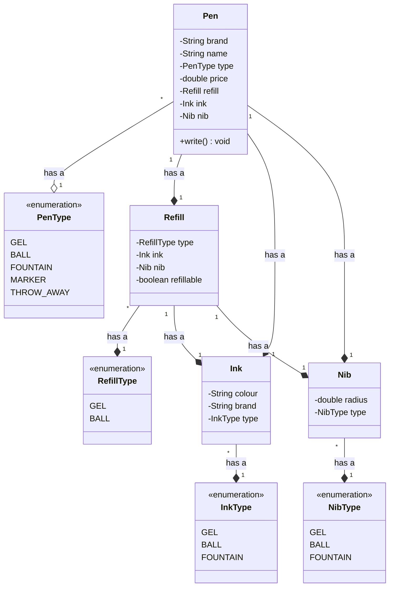
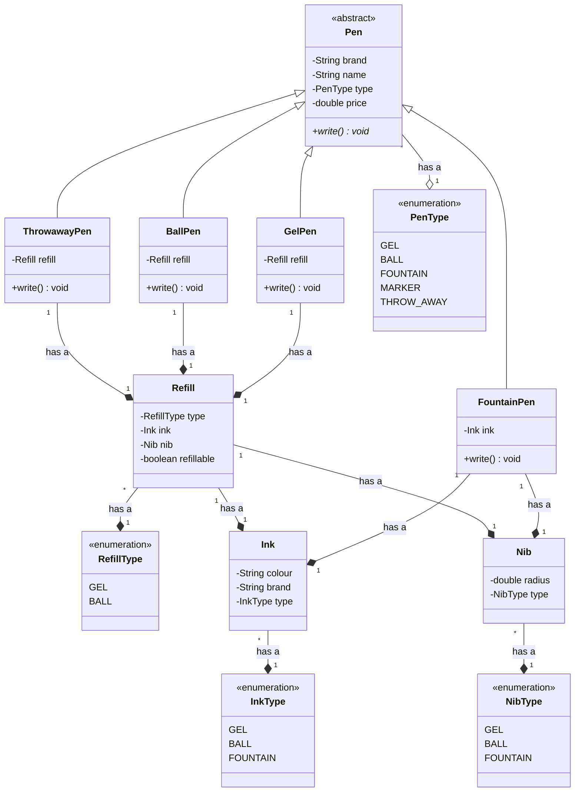
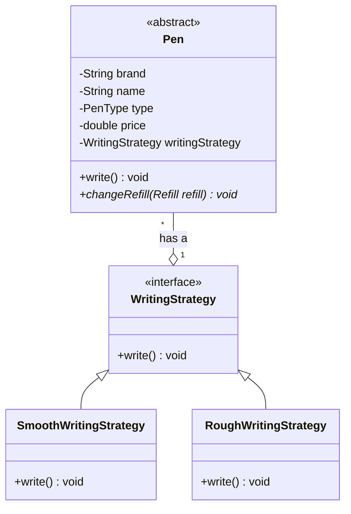
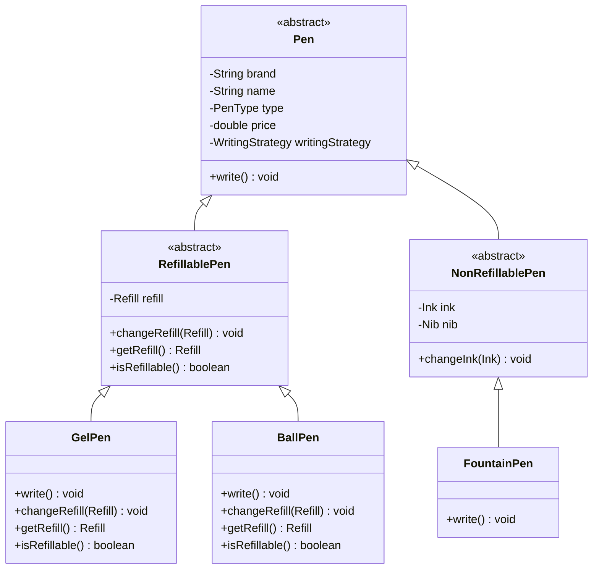
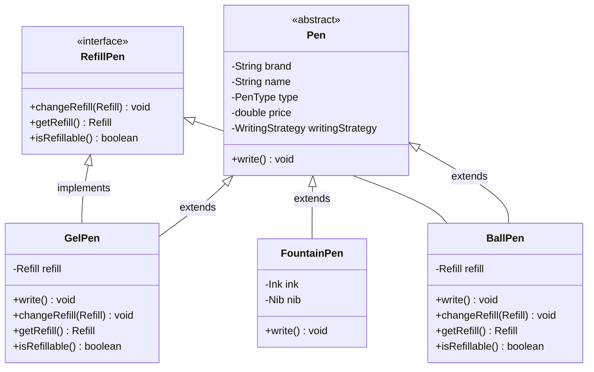

# Design a pen

## Requirements

* A pen is anything that can write.
* Pen can be Gel, Ball, Fountain, Marker.
* Ball Pen and Gel Pen have a Ball Pen Refill and a Gel Pen Refill respectively to write.
* A refil has a tip and an ink.
* Ink can be of different colour
* A fountain pen has an Ink.
* Refil has a radius. 
* For fountain pen, its tip has a radius.
* Each pen can write in a different way.
* Some pens write in the same way.
* Every pen has a brand and a name.
* Some pens may allow refilling while others might not.

## Entities and Attributes

* Pen
  * Brand
  * Name
  * Type (Gel, Ball, Fountain, Marker)
  * Price
*  Refill
  * Type (Ball, Gel)
  * Ink
  * Nib
* Ink
  * Colour
  * Brand
  * Type (Gel, Ball, Fountain)
* Nib
  * Radius
  * Type (Fountain, Ball, Gel)  

### Different types of pens
* Gel Pen
  * Type - `Gel`
  * Refill
    * Type - `Gel`
    * Nib - `Gel`
    * Ink
      * Type - `Gel`
    * Refillable - `Yes`

* Ball Pen
  * Type - `Ball`
  * Refill
    * Type - `Ball`
    * Nib - `Ball`
    * Ink
      * Type - `Ball`
    * Refillable - `Yes`

* Throwaway Pen
  * Type - `Throwaway`
  * Refill
    * Type - `Ball`
    * Nib - `Ball`
    * Ink
      * Type - `Ball`
    * Refillable - `No`

* Fountain Pen
  * Type - `Fountain`
  * Ink
    * Type - `Fountain`
  * NiB
    * Type - `Fountain`


## Single class



### Java Code

```java
public class Pen {
    private String brand;
    private String name;
    private PenType type;
    private double price;
    private Refill refill;
    private Ink ink;
    private Nib nib;

    public void write() {
        switch (type) {
            case GEL:
                System.out.println("Gel Pen writes");
                break;
            case BALL:
                System.out.println("Ball Pen writes");
                break;
            case FOUNTAIN:
                System.out.println("Fountain Pen writes");
                break;
            case MARKER:
                System.out.println("Marker Pen writes");
                break;
            case THROW_AWAY:
                System.out.println("Throwaway Pen writes");
                break;
        }

        throw new IllegalArgumentException("Invalid Pen Type");
    }

    public void changeRefill(Refill refill) {
        if (this.refill.isRefillable()) {
            this.refill = refill;
        }
    }

    public void changeInk(Ink ink) {
        this.ink = ink;
    }
}
```

### Problems
  * `Single Responsibility Principle` is violated. There are multiple reasons to change the class such as modifying a single type of pen.
  * `Open Closed Principle` is violated. Adding a new type of pen requires changing the class.
  * `Null checks` are required for handling refill and ink for fountain pens.
  * `Object creation` is complex

## Multiple classes (Inheritance)



### Java Code

[Java Code](../src/main/java/com/scaler/lld/pen/multipleclasses/)

### Improvements
  * `Single Responsibility Principle` is followed. Each class has a single responsibility.
  * `Open Closed Principle` is followed. Adding a new type of pen does not require changing the class.
  * `Null checks` are not required for handling refill and ink for fountain pens.

### Problems
  * `Object creation` is still complex
  * `Liskov Substitution Principle` is violated since `FountainPen` does not have a refill, and it throws an exception when `changeRefill` is called.
  * `Code duplication` 
  * `Subclasses` are used to create objects.

---

## Reducing code duplication using Strategy Pattern



### Java Code
[Pen class with strategy](../src/main/java/com/scaler/lld/pen/withstrategy/Pen.java)

---

## Avoiding LSP using abstract classes



### Java Code
[Pen class with abstract classes](../src/main/java/com/scaler/lld/pen/abstractclasses/)

### Improvements
  * `Liskov Substitution Principle` is followed since `FountainPen` does not have a refill, and it throws an exception when `changeRefill` is called.
  * No field duplication in child classes.

### Problems
  * Behaviour is tied to the class hierarchy. Adding a new type of pen requires changing the class hierarchy.

## Avoiding LSP violation using interface



### Java Code
[Pen class with interface](../src/main/java/com/scaler/lld/pen/withinterface/)

### Problems
  * Field duplication in child classes.