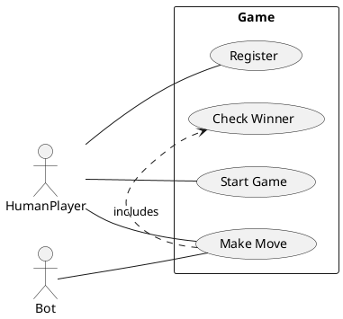
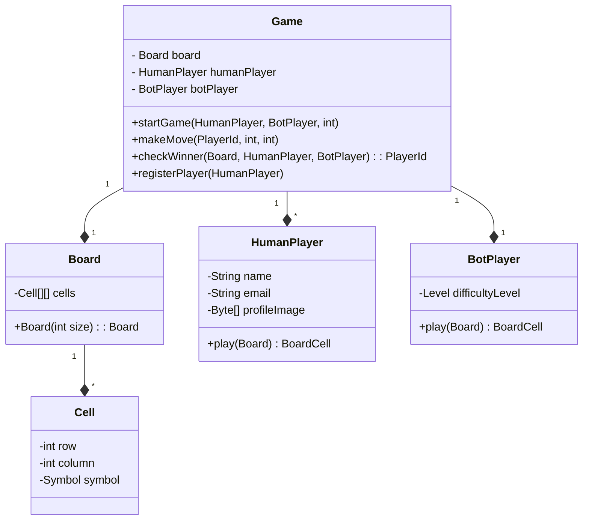
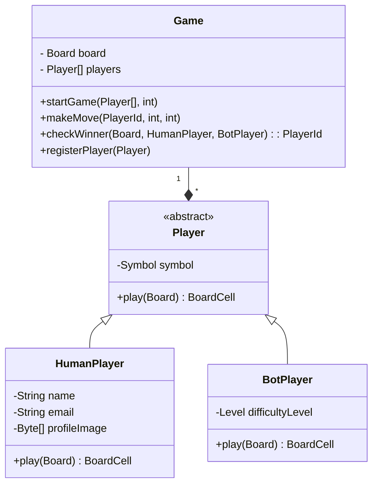
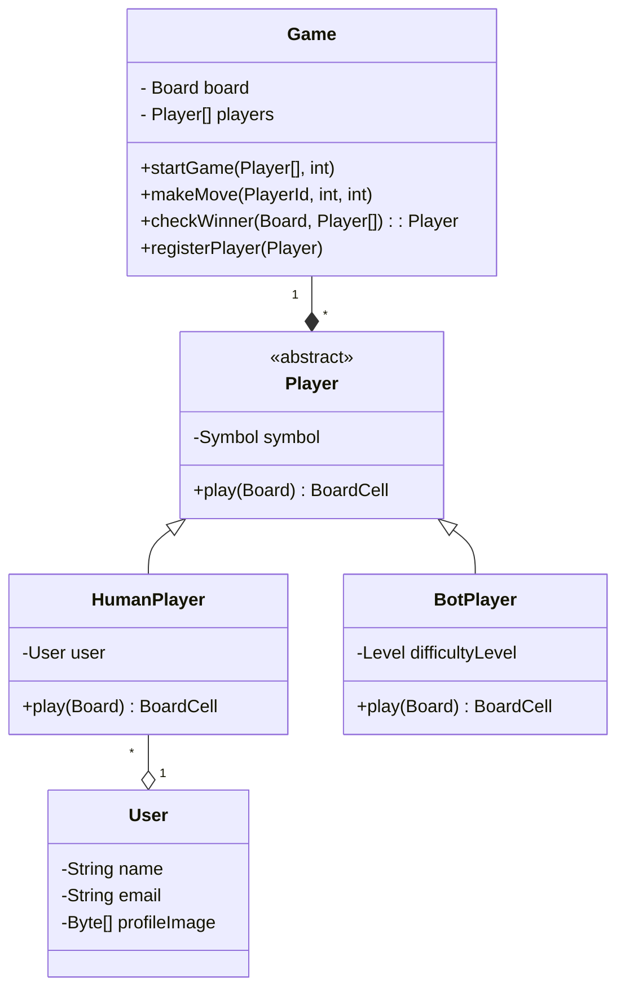
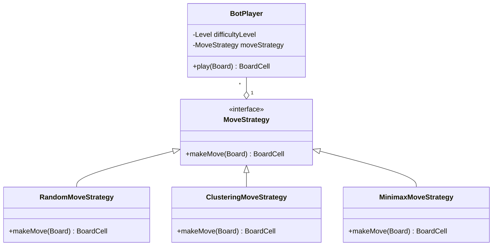
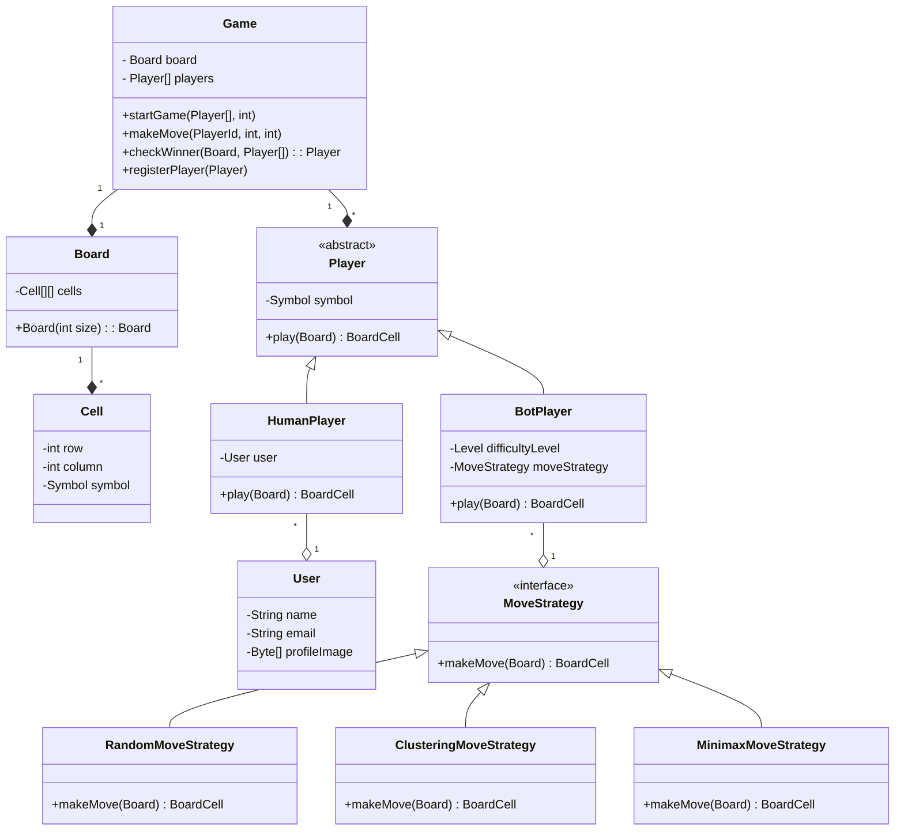
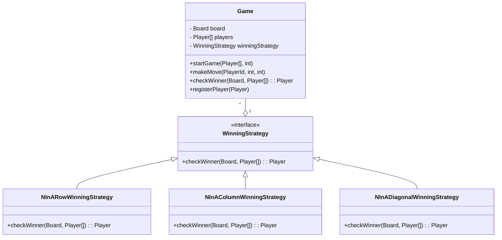

# Design Tic-Tac-Toe

## What is Tic-Tac-Toe?

TicTacToe is a 2 player game played on a 3 x 3 board. Each player is allotted a symbol (one X and one O). Initially, the board is empty. Alternatively, each player takes a turn and puts their symbol at any empty slot. The first player to get their symbol over a complete row OR a complete column OR a diagonal wins.

You can play the game within Google Search by just searching for “tictactoe”!

## Questions to Ask
* Will the game be played amongst only 2 players or can there be any number of players in future?
* Is the board size restricted to 3x3 or can it be any NxN?
* Can there be different ways to win?
* Can one of the players be a bot?
* Feature Suggestions:
  * Do we want to time a move? Skip/ Declare the other person as winner if the move doesn’t happen within x seconds.
  * Do we want to support undo operation?
  * Can there be some players who are just watching? Not playing.
  * Do we want to store analytics? Basically previous games, who played what move etc.
  * Support for tournaments? Basically a set of matches, each match between 2 players of the tournament.

## Expectations
* The code should be working and functionally correct
* Good software design practices should be followed:
* Code should be modular, readable, extensible
* Separation of concern should be addressed
* Project structured well across multiple files/ packages
* Write unit tests
* No need of GUI

## Problem Requirements
* Board can be of any NxN size.
* There can be two players.
* Each player will be allotted a symbol.
* The symbol can be one of O and X.
* The players can be either humans or bots.
* Each human player will have a name, email and profile image.
* Each bot player will have a difficulty level.
* Any random player can start the game.
* Then the players will take turns alternatively.
* The player with any consecutive N symbols in a row, column or diagonal wins.
* If the board is full and no player has won, the game is a draw.

## Entities and their attributes
* Game
  * Board
  * Players
* Board
  * Cells
* Cell
  * Row
  * Column
  * Symbol
* Human Player
  * Name
  * Email
  * Profile Image
* Bot Player
  * Difficulty Level

## Design 

### Use Case Diagram

### API or CLI Design
The usecase diagram gives us a good idea of the API design. We can have the following APIs:
* Register a player
  * `API` - `POST /register` - `{"name": "Paul Morphy", "email": "blind@chess.in", ...}`
  * `CLI` - `tictactoe register --name <name> --email <email> --profile-image <profile-image>`
* Start a game
  * `API` - `POST /game/start` - `{"player1": "paul", "player2": "bot", "board-size": 3}`
  * `CLI` - `tictactoe start --player1 <player1> --player2 <player2> --board-size <board-size>`
* Make a move
  * `API` - `POST /game/move` - `{"player": "paul", "row": 1, "column": 2}`
  * `CLI` - `tictactoe move --player <player> --row <row> --column <column>`

### Class Diagram

#### Initial design

**Problems:**
* The Game class is tightly coupled with the HumanPlayer and BotPlayer classes. It is not extensible to support any other type of player and number of players.
* There is no common contract for the players.
* `Huge memory consumption` - A player can play multiple games at the same time. Each will have a new `HumanPlayer` object. Each player object will have the profile image. This will consume a lot of memory.
* Implementing the `play` method for the bot player will lead to SRP and OCP violations because it will be deciding the move based on the difficulty level. This will lead to a lot of if-else conditions.

#### Adding a contract for players using an abstract class

**Problems so far:**
* ~~The Game class is tightly coupled with the HumanPlayer and BotPlayer classes. It is not extensible to support any other type of player and number of players.~~
* ~~There is no common contract for the players.~~
* `Huge memory consumption` - A player can play multiple games at the same time. Each will have a new `HumanPlayer` object. Each player object will have the profile image. This will consume a lot of memory.
* Implementing the `play` method for the bot player will lead to SRP and OCP violations because it will be deciding the move based on the difficulty level. This will lead to a lot of if-else conditions.

#### Solving the memory consumption problem using Flyweight pattern

**Problems so far:**
* ~~`Huge memory consumption` - A player can play multiple games at the same time. Each will have a new `HumanPlayer` object. Each player object will have the profile image. This will consume a lot of memory.~~
* Implementing the `play` method for the bot player will lead to SRP and OCP violations because it will be deciding the move based on the difficulty level. This will lead to a lot of if-else conditions.

#### Fixing the SRP and OCP violations using Strategy pattern

**Problems so far:**
* ~~`Huge memory consumption` - A player can play multiple games at the same time. Each will have a new `HumanPlayer` object. Each player object will have the profile image. This will consume a lot of memory.~~
* ~~Implementing the `play` method for the bot player will lead to SRP and OCP violations because it will be deciding the move based on the difficulty level. This will lead to a lot of if-else conditions.~~

### Complete Class Diagram

### Future requirement - Different winning conditions for different number of players

* We want to support different winning conditions for different number of players.
* Games can same winning conditions for different number of players and different winning conditions for same number of players.
* Solution - Use a strategy pattern to decide the winning condition for a game.

### Side assignment
* A common requirement in games is to undo the last move. How would you design your system to support this requirement?

