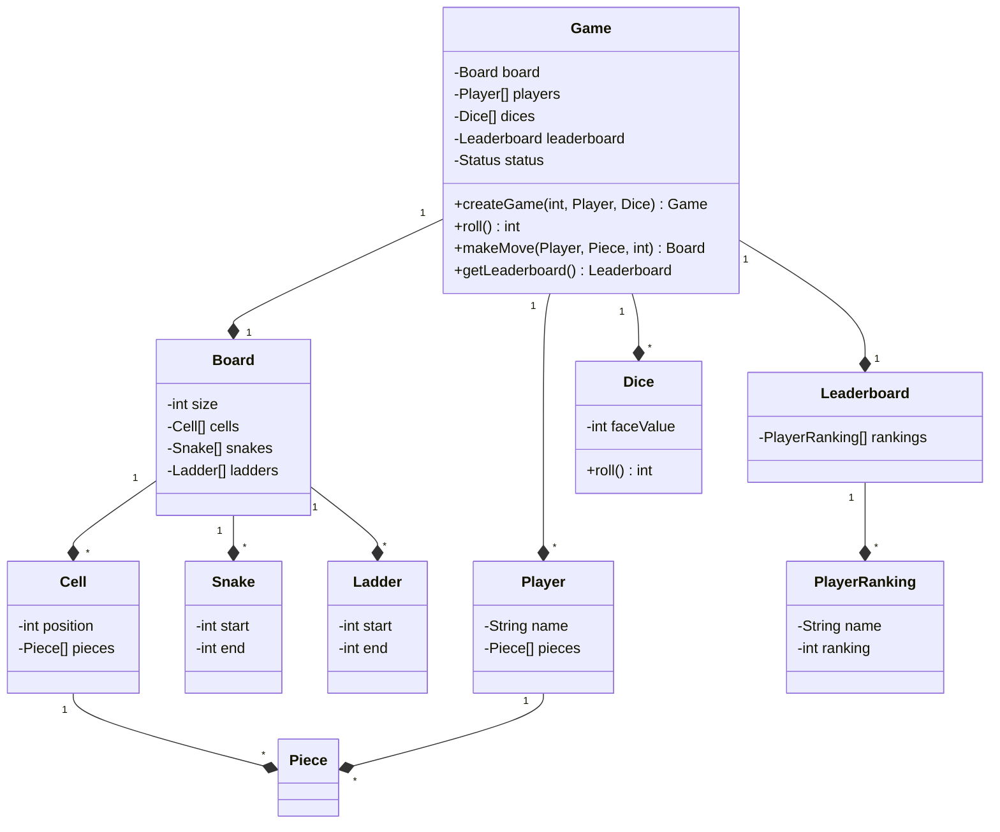
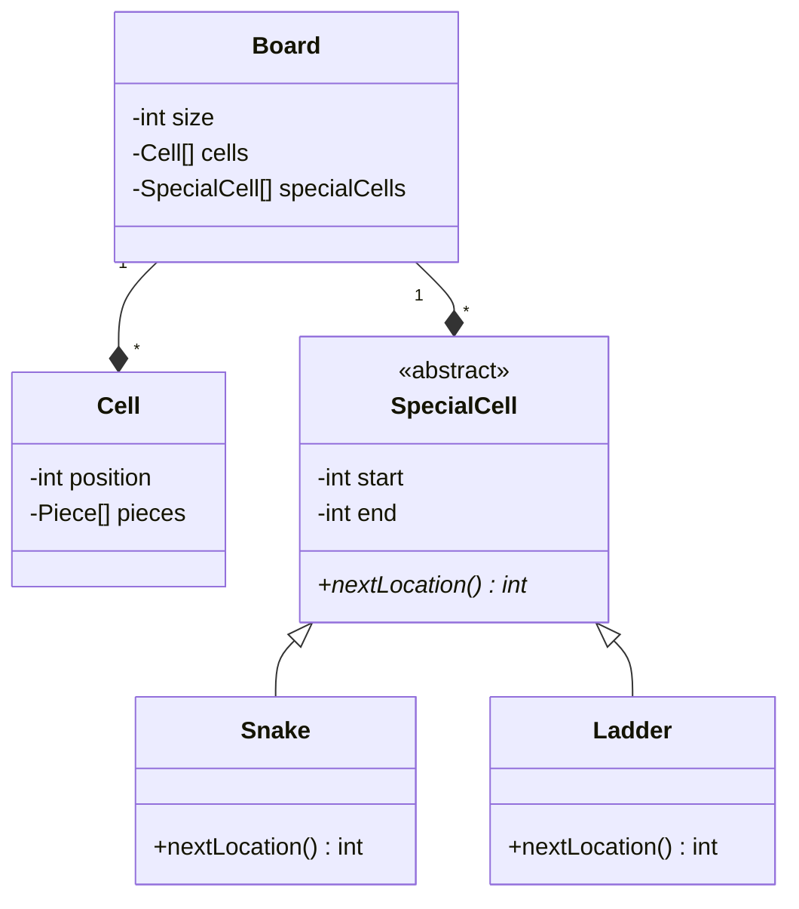
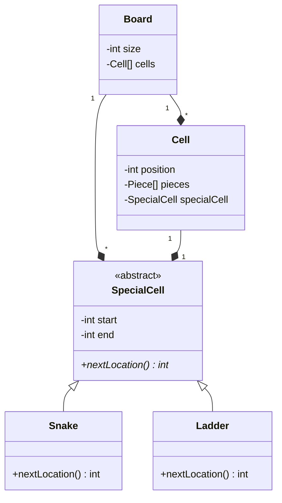
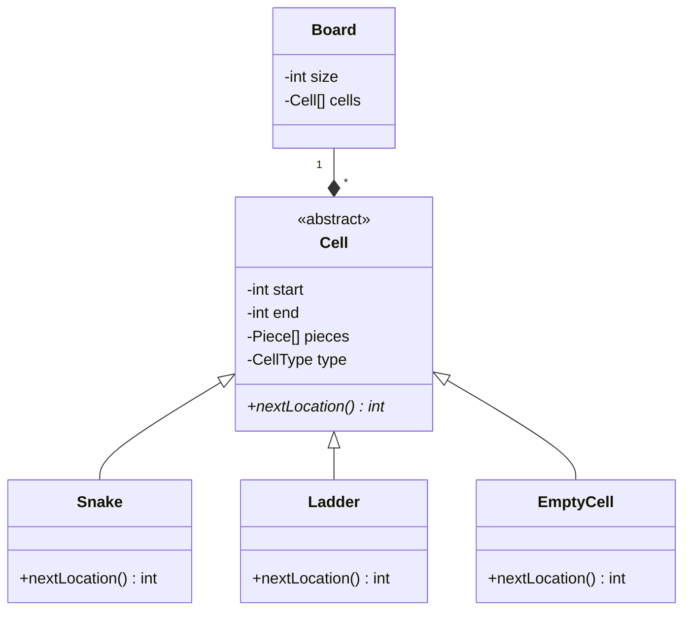

# Design Snakes and Ladders

Snakes and ladders is an ancient Indian board game that's regarded today as a worldwide classic. It requires two or more players and takes place on a board with numbered, gridded squares. Throughout the board, there are snakes and ladders which connect different squares. Players roll a die and navigate the board. Landing on a ladder advances a player to a square further up the board, while landing on a snake means they have to go back to a previous square.

The aim of the game is to reach the final square. 

## Problem requirements

* A game can be between multiple players.
* A game will only have human players
* Each player can have multiple pieces
* A board can be of any varying size decided by the client
* A board will different types of cells
* There can be a normal cell and cells with snakes and ladders
* Position of snakes and ladders is random and decided at the start of the game
* The number of snakes and ladders is random and also decided at the start of the game
* The size of snakes and ladders is also random and decided at the start of the game
* A player will move on the basis of a dice
* A player will enter the game only if they get a 1 or maximum face value of the dice
* A player will win if they reach the last cell
* The game will end when all players expect one reach the last cell
* For each game maintain a leaderboard which has the rankings of each player

## Entities and their attributes

* Game
  * Board
  * Players
  * Dices
  * Leaderboard
  * Status
* Board
  * Dimensions
  * Cells
  * Snakes
  * Ladders
* Cell
  * Position
  * Pieces
  * Type?
* Snakes/Ladders
  * Start
  * End
* Player
  * Name
  * Pieces
* Leaderboard
  * Players
  * Rankings

## Initial Design 

### Problems with the initial design
* No common interface for Snake and Ladder which leads to OCP violation in Board class.

## Adding a new parent class for Snake and Ladder

### Problems
* Identifying if the cell has a snake or a ladder is not trivial. The client has to iterate over the list of special cells and check if the cell is present in the list.

## Optimizing the design - Composing cell with special cell

### Problems
* ~~Identifying if the cell has a snake or a ladder is not trivial. The client has to iterate over the list of special cells and check if the cell is present in the list.~~
* Null checks are required to check if the cell has a special cell or not.

## Optimizing the design - Bringing cell and special cell in the same hierarchy

