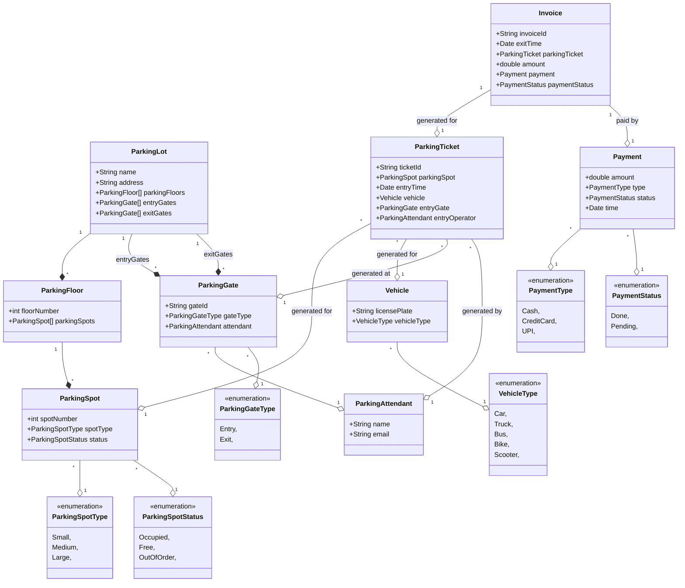

# Design a parking lot

> A parking lot or car park is a dedicated cleared area that is intended for parking vehicles. In most countries where cars are a major mode of transportation, parking lots are a feature of every city and suburban area. Shopping malls, sports stadiums, megachurches, and similar venues often feature parking lots over large areas
[Reference](https://github.com/tssovi/grokking-the-object-oriented-design-interview/blob/master/object-oriented-design-case-studies/design-a-parking-lot.md)


> Parking lot is an open area designated for parking cars. We will design a parking lot where a certain number of cars can be parked for a certain amount of time. The parking lot can have multiple floors where each floor carries multiple slots. Each slot can have a single vehicle parked in it.
[Reference](https://medium.com/double-pointer/system-design-interview-parking-lot-system-ff2c58167651)


## Requirements gathering

What are some questions you would ask to gather requirements?
```
1. Can a parking lot have multiple floors?
2. Can a parking lot have multiple entrances?
3. Can a parking lot have multiple exits?
4. Can a parking lot have multiple types of vehicles?
5. Can we park any type of vehicle in any slot?
6. How do we get a ticket?
7. How do we know if a slot is empty?
8. How are we allocated a slot?
9. How do we pay for parking?
10. What are the multiple ways to pay for parking?
```

## Requirements
What will be 10 requirements of the system, according to you?
Do not worry about the correctness of the requirements, just write down whatever comes to your mind.
Your job is not to generate the requirements, but get better at understanding problem statements and anticipating the functionalities your application might need.

Build an online parking lot management system that can support the following requirements:
* Should have multiple floors.
* Multiple entries and exit points.
* A person has to collect a ticket at entry and pay at or before exit.
* Pay at:
    * Exit counter (Cash to the parking attendant)
    * Dedicated automated booth on each floor
    * Online
* Pay via:
    * Cash
    * Credit Card
    * UPI
* Allow entry for a vehicle if a slot is available for it. Show on the display at entry if a slot is not available.
* Parking Spots of 3 types:
    * Large
    * Medium
    * Small
* A car can only be parked at its slot. Not on any other (even larger).
* A display on each floor with the status of that floor.
* Fees calculated based on per hour price: e.g. 50 rs for the first hour, then 80 rs per extra hour.
  * Small - 50, 80
  * Medium - 80, 100
  * Large - 100, 120

## Use case diagrams

Are the requirements clear enough to define use cases?
If not, try to think of the actors and their interactions with the system.

### Actors
What would be the actors in this system?
1. Customer
2. Parking Attendant, Operator
3. Admin

### Use cases

What would be the use cases i.e. the interactions between the actors and the system?

#### Actor 1

Name of the actor - `Admin`

Use cases: `CRUD`
1. `Create a parking lot`
2. `Create a parking floor`
3. `Add new parking spots`
4. `Update status of a parking spot`

#### Actor 2

Name of the actor - `Parking attendant`
Use cases:
1. `Check empty slots`
2. `Issue a ticket` - `Allocating a slot`
3. `Collect payment`
4. `Checkout` - `Has the user paid?`

#### Actor 3

Name of the actor - `Customer`
Use cases:
1. `Pay` - `Pay online`, `Pay at exit gate`
2. `Check status`

Add more actors and their use cases as needed.


## Class diagram

What will be the major classes and their attributes?

* ParkingLot
  * Name
  * Address
  * ParkingFloors
  * Entry Gates
  * Exit Gates

* ParkingFloor
  * Floor Number
  * ParkingSpots

* ParkingSpot
  * Spot Number
  * Spot Type - `Large, Medium, Small`
  * Status - `Occupied, Free, Out of order`

* ParkingTicket
  * Ticket ID
  * ParkingSpot
  * Entry Time
  * Vehicle
  * Entry Gate
  * Entry Operator

* Invoice
  * Invoice ID
  * Exit Time
  * ParkingTicket
  * Amount
  * Payment
  * Payment Status
  
* Payment
  * Amount
  * Type - `Cash, Credit Card, UPI`
  * Status - `Done, Pending`
  * Time
  
* Vehicle
  * License Plate
  * Vehicle Type - `Car, Truck, Bus, Bike, Scooter`

* ParkingAttendant
  * Name
  * Email
  
Draw the class diagram.


Look for differences between your class diagram and the one in the solution. List them down below.

```
1. 
2. 
3.
4.
5.
```