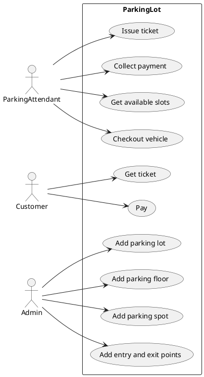

# Design a parking lot

> A parking lot or car park is a dedicated cleared area that is intended for parking vehicles. In most countries where cars are a major mode of transportation, parking lots are a feature of every city and suburban area. Shopping malls, sports stadiums, megachurches, and similar venues often feature parking lots over large areas
[Reference](https://github.com/tssovi/grokking-the-object-oriented-design-interview/blob/master/object-oriented-design-case-studies/design-a-parking-lot.md)


> Parking lot is an open area designated for parking cars. We will design a parking lot where a certain number of cars can be parked for a certain amount of time. The parking lot can have multiple floors where each floor carries multiple slots. Each slot can have a single vehicle parked in it.
[Reference](https://medium.com/double-pointer/system-design-interview-parking-lot-system-ff2c58167651)


## Requirements gathering

What are some questions you would ask to gather requirements?
```
1. Can a parking lot have multiple floors?
2. Can a parking lot have multiple entrances?
3. Can a parking lot have multiple exits?
4. Can a parking lot have multiple types of vehicles?
5. Can we park any type of vehicle in any slot?
6. How do we get a ticket?
7. How do we know if a slot is empty?
8. How are we allocated a slot?
9. How do we pay for parking?
10. What are the multiple ways to pay for parking?
```

## Requirements
Build an online parking lot management system that can support the following requirements:
* Should have multiple floors.
* Multiple entries and exit points.
* A person has to collect a ticket at entry and pay at or before exit.
* Pay at:
    * Exit counter (Cash to the parking attendant)
    * Dedicated automated booth on each floor
    * Online
* Pay via:
    * Cash
    * Credit Card
    * UPI
* Allow entry for a vehicle if a slot is available for it. Show on the display at entry if a slot is not available.
* Parking Spots of 3 types:
    * Large
    * Medium
    * Small
* A car can only be parked at its slot. Not on any other (even larger).
* A display on each floor with the status of that floor.
* Fees calculated based on per hour price: e.g. 50 rs for the first hour, then 80 rs per extra hour.
  * Small - 50, 80
  * Medium - 80, 100
  * Large - 100, 120

## Use case diagrams

Are the requirements clear enough to define use cases?
If not, try to think of the actors and their interactions with the system.

### Actors
What would be the actors in this system?
```
1. Parking Attendant
2. Customer
3. Admin
```

### Use cases

What would be the use cases i.e. the interactions between the actors and the system?

#### Actor 1

Name of actor - `Parking Attendant`

Use cases:
1. `Issue ticket`
2. `Collect payment`
3. `Get available slots`
4. `Checkout vehicle`

#### Actor 2

Name of actor - `Customer`
Use cases:
1. `Get ticket`
2. `Pay`

#### Actor 3

Name of actor - `Admin`
Use cases:
1. `Add parking lot`
2. `Add parking floor`
3. `Add parking spot`
4. `Add entry and exit points`

Draw the use case diagram.


## Class diagrams

What will be the major classes and their attributes?

```
    Class name
        - Attribute 1
        - Attribute 2
        ...
```

Draw the class diagram.
```
```

